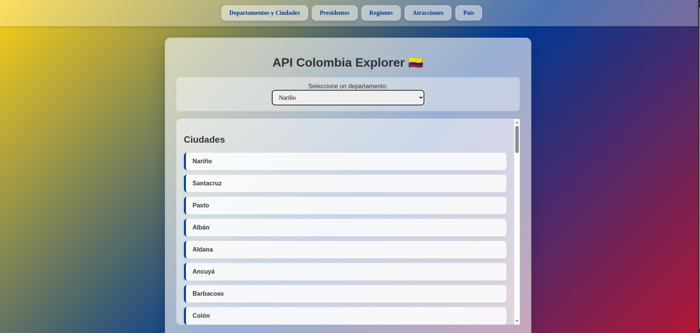

# 🇨🇴 API Colombia Explorer

Una aplicación web interactiva que permite explorar información detallada sobre Colombia: sus departamentos, ciudades, presidentes, regiones, atracciones turísticas, y más. Utiliza la [API Colombia](https://api-colombia.com/) para obtener datos en tiempo real.



---

## 🚀 Características

- ✅ Lista interactiva de **departamentos y ciudades**
- ✅ Vista cronológica de los **presidentes** de Colombia
- ✅ Consulta de **regiones geográficas**
- ✅ Información sobre **atracciones turísticas**
- ✅ Datos generales del **país**
- ✅ Interfaz moderna con diseño transparente (glassmorphism)
- ✅ Navegación rápida entre secciones

---

## 🧑‍💻 Tecnologías usadas

- **HTML5** – estructura semántica
- **CSS3** – diseño responsivo con fondo inspirado en la bandera de Colombia
- **JavaScript (ES6)** – lógica de consumo de API y render dinámico
- **[API Colombia](https://api-colombia.com/)** – fuente de datos principal

---

## 📁 Estructura del proyecto

```
📦 API-Colombia-Explorer
├── index.html
├── styles.css
├── script.js
└── README.md
```

---

## 🔧 Cómo usarlo

### 1. Clonar el repositorio

```bash
git clone https://github.com/CRISTIAN7712/Web-API-Colombia.git
cd API-Colombia-Explorer
```

### 2. Abrir el archivo en tu navegador

Puedes simplemente abrir el archivo `index.html` en tu navegador favorito:

```bash
start index.html  # En Windows
open index.html   # En macOS
```

> ⚠️ No se necesita servidor local ni dependencias externas.

---

## 🌐 Enlace a la API

Este proyecto utiliza:  
🔗 https://api-colombia.com/api/v1

Puedes explorar directamente los endpoints que se usan:
- `/Department`
- `/Department/{id}/cities`
- `/President`
- `/Region`
- `/TouristicAttraction`
- `/Country/Colombia`

---

## ✨ Capturas de pantalla

- Navegación por departamentos y ciudades
- Listado de presidentes en orden cronológico
- Vista elegante con fondo tipo bandera nacional y efecto translúcido

---

## 📌 Mejoras futuras

- 🔍 Buscador de ciudades y presidentes
- 🌍 Mapa interactivo de departamentos
- 📱 Optimización adicional para móviles
- 🌐 Soporte multilenguaje

---

## 📄 Licencia

MIT License.  
Desarrollado con ❤️ para fines educativos y exploratorios sobre Colombia.

---

## 🤝 Contribuciones

¡Las contribuciones son bienvenidas! Puedes:
- Reportar errores
- Sugerir mejoras
- Enviar PR con nuevas funcionalidades

---

## 👨‍⚕️ Autor

Desarrollado por **Ing. Cristian Díaz**  
Diseño adaptado y optimizado para propósitos médicos y clínicas.

---

<p align="center">
  
</p>
